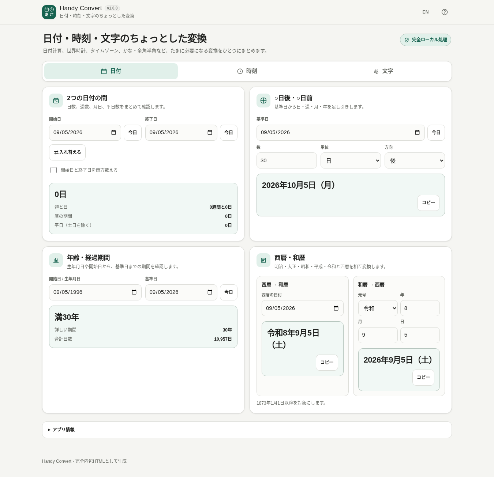

# Handy Convert

[](https://github.com/ttomohisa/htmlapps-handy-convert/actions/workflows/deploy-pages.yml)
[](LICENSE)
[](https://ttomohisa.github.io/htmlapps-handy-convert/)

[English README](README.md)

日付計算、タイムゾーン、西暦・和暦、かな、全角・半角などのちょっとした変換を、ブラウザー内だけで行う単一HTMLアプリです。入力した日付や文字列を、このアプリから外部サーバーへ送信しません。

## 🚀 デモ

### [GitHub PagesでHandy Convertを開く](https://ttomohisa.github.io/htmlapps-handy-convert/)

GitHub Pagesから最初のHTMLを読み込んだ後、日付計算、世界時計、タイムゾーン変換、和暦変換、かな変換、全角・半角変換は端末内で処理されます。

[](https://ttomohisa.github.io/htmlapps-handy-convert/)

## 主な機能

- **2つの日付を比較** — 日数、週＋日、暦上の経過期間、平日数をまとめて確認できます。
- **○日後・○日前を計算** — 日・週・月・年を加減算し、月末に同じ日が存在しない場合はその月の最終日に合わせます。
- **年齢・経過期間を確認** — 開始日から基準日までの年・月・日と総日数を表示します。
- **西暦と和暦を相互変換** — 明治・大正・昭和・平成・令和に対応し、元号の境界も検証します。
- **世界時計を端末内で利用** — 都市を検索・追加し、日付の前後関係やUTCオフセットを比較できます。保存するのは追加した都市だけです。
- **タイムゾーンを日時指定で変換** — ブラウザーのIANAタイムゾーン情報を使い、夏時間で存在しない時刻や2回存在する時刻も区別します。
- **1つの入力からかなを変換** — ひらがな・カタカナ・半角カナを同時に表示します。
- **全角・半角を必要な範囲だけ変換** — 英字・数字・記号・スペースを個別に選び、関係ないUnicode文字はそのまま残します。
- **日本語 / 英語・スマートフォン対応** — PCでもスマートフォンでも「日付 / 時刻 / 文字」を切り替えて使えます。
- **完全ローカル処理の単一HTML** — 実行時のCDN、分析、テレメトリー、外部フォント、外部APIを必要としません。

## すぐに使う

### Webで使う

[デモを開く](https://ttomohisa.github.io/htmlapps-handy-convert/)だけで利用できます。インストールやアカウント登録は不要です。

### 単一HTMLをダウンロードして使う

1. このリポジトリから `dist/index.html` または `dist/index.self-extract.html` をダウンロードします。
2. 現在のブラウザーでファイルを開きます。
3. ローカルWebサーバーを用意しなくても、その1ファイルだけで利用できます。

`dist/index.html` は読みやすい通常の単一HTML版です。`dist/index.self-extract.html` は同じアプリをgzip圧縮した状態で保持し、ブラウザーの `DecompressionStream` で端末内展開する版です。

### 自分でビルドする（上級者向け）

1. Windowsでこのリポジトリをダウンロードまたはクローンします。
2. `build-standalone.bat` をダブルクリックします。
3. リポジトリ検査とビルドが実行され、`dist/` に単一HTMLが生成されます。
4. 生成されたHTMLを任意の場所へコピーして利用できます。

Handy Convertにはサードパーティ製の実行時ライブラリ依存がないため、通常ビルドでライブラリをダウンロードする必要はありません。Node.js、Python、ローカルWebサーバーも不要です。

## 使い方

### 日付

- **2つの日付の間** — 開始日と終了日を指定すると、日数、週＋日、暦上の期間、平日数を表示します。「開始日と終了日を両方数える」を有効にすると両端を含めて数えます。
- **○日後・○日前** — 基準日、数値、単位、前後を指定します。月・年の移動先に同じ日が存在しない場合は月末に合わせます。
- **年齢・経過期間** — 開始日または生年月日と基準日を指定します。表示は暦上の経過期間であり、法令上の年齢判定ではありません。
- **西暦・和暦** — 双方向に変換できます。対応範囲は1873年1月1日以降です。

### 時刻

- **世界時計** — 都市を検索して追加・削除し、現在時刻、日付の前後関係、UTCオフセットを比較します。削除した都市はUndoで戻せます。
- **タイムゾーン変換** — 変換元と変換先の都市、変換元の現地日時を指定します。夏時間の切り替えで存在しない現地時刻は勝手に補正せずエラーにし、同じ現地時刻が2回存在する場合は1回目 / 2回目を選べます。

世界時計の現在時刻は端末時計を基準にします。端末時刻がずれている場合、表示時刻も同じようにずれます。

### 文字

- 文字列を1回入力または貼り付けると、**ひらがな**、**カタカナ**、**半角カナ**を同時に表示します。
- 全角・半角変換は **英字**、**数字**、**記号**、**スペース**を個別に対象指定できます。
- 漢字・絵文字など、指定した変換範囲に含まれない文字はそのまま残します。
- 各結果は個別にコピーできます。入力をクリアした後はUndoで戻せます。

## GitHub Pagesで公開する

このリポジトリには、単一HTMLを検査して `dist/` をGitHub Pagesへ公開するワークフローが含まれています。

1. リポジトリ名を `htmlapps-handy-convert` としてGitHubへプッシュします。
2. **Settings → Pages → Build and deployment → Source** で **GitHub Actions** を選択します。
3. `main` へプッシュするか、Actions画面から **Deploy standalone app to GitHub Pages** を手動実行します。
4. 成功後、`https://ttomohisa.github.io/htmlapps-handy-convert/` で利用できます。

`main` へのプッシュ時には `scripts/check-repository.ps1` が実行され、単一HTMLの再生成、リポジトリ検査、オフライン要件の確認後に `dist` ディレクトリが公開されます。

## 開発とビルド

```text
.
├─ src/index.template.html       # アプリ本体のテンプレート
├─ app.config.json               # アプリ情報とビルド設定
├─ dependencies.json             # 実行時依存の宣言（このアプリでは空）
├─ dependencies.lock.json        # 依存ロック
├─ build-standalone.bat          # Windows用ビルド入口
├─ build-standalone.ps1          # 単一HTMLビルダー
├─ scripts/check-repository.ps1  # リポジトリ / ビルド検査
├─ dist/
│  ├─ index.html                 # 通常の単一HTML版
│  └─ index.self-extract.html    # 圧縮自己展開版
└─ .github/workflows/
   ├─ build-standalone.yml       # Pull Request時のビルド検証
   ├─ deploy-pages.yml           # mainからGitHub Pagesへ公開
   └─ dependency-updates.yml     # 定期依存チェック
```

### ビルドと検査

Windowsで実行します。

```bat
build-standalone.bat
```

CIと同じリポジトリ全体の検査を行う場合：

```powershell
./scripts/check-repository.ps1
```

ビルド・検査では主に以下を確認します。

- テンプレートの必須プレースホルダーが正しく1回だけ置換されること
- 単一HTMLが生成され、UTF-8として扱えること
- `app.config.json` の設定どおり実行時通信が禁止されていること
- 禁止された外部ランタイム参照が残っていないこと
- 自己展開版が元の `dist/index.html` と同じHTMLを復元すること
- 必須リポジトリファイルとリリース用アセットが揃っていること

## プライバシーと実行時通信

変換処理はブラウザー内で行います。

- Content Security Policy に `connect-src 'none'` を設定しています。
- 分析やテレメトリーは使用しません。
- 外部フォント、CDN、実行時APIを必要としません。
- 入力した日付、生年月日、タイムゾーン変換日時、文字列はアプリから保存しません。
- `localStorage` に保存する可能性があるのは、表示言語、最後に開いたカテゴリ、世界時計へ追加した都市です。

GitHub Pages版では最初のHTMLを取得する通信は発生しますが、読み込み後の変換機能は実行時の外部通信を必要としません。ネットワークを完全に切って利用する場合は、生成済みの `dist/` 内HTMLをローカルで開いてください。

## ブラウザー対応

主対象：

- Chrome
- Edge
- Androidの現在の主要ブラウザー
- iPhoneの現在の主要ブラウザー

Firefox / Safariも、利用するブラウザー標準APIが利用できる範囲で対応します。レイアウトは320px幅から確認しています。

自己展開版では `DecompressionStream` が必要です。非対応ブラウザーでは `dist/index.html` を利用してください。

## 制限事項

- 平日数は土曜日・日曜日のみを除き、祝日や国別営業日は考慮しません。
- 年齢表示は暦上の経過期間であり、法令上の年齢判定を目的としません。
- 和暦変換は1873年1月1日以降が対象です。旧暦など歴史的な暦変換は行いません。
- タイムゾーン変換はブラウザーに含まれるIANAタイムゾーン情報を利用するため、非常に古いブラウザーではルールが古い可能性があります。
- 世界時計は端末時計を基準にし、ネット時刻サービスとの同期は行いません。
- 全角・半角変換は指定した対象範囲だけを変更し、関係ないUnicode文字は意図的に維持します。

## 使用ライブラリ

Handy Convertには、配布HTMLへ内包するサードパーティ製の実行時ライブラリはありません。

日付・時刻の処理にはJavaScriptとブラウザー標準の `Intl` APIを利用しています。リポジトリ上の表記は [THIRD_PARTY_NOTICES.md](THIRD_PARTY_NOTICES.md) を確認してください。

## コントリビューション

バグ報告や機能提案はGitHub Issuesからお願いします。開発への参加方法は [CONTRIBUTING.md](CONTRIBUTING.md) を確認してください。

## ライセンス

Copyright © 2026 ttomohisa

このプロジェクトは [MIT License](LICENSE) で公開されています。
