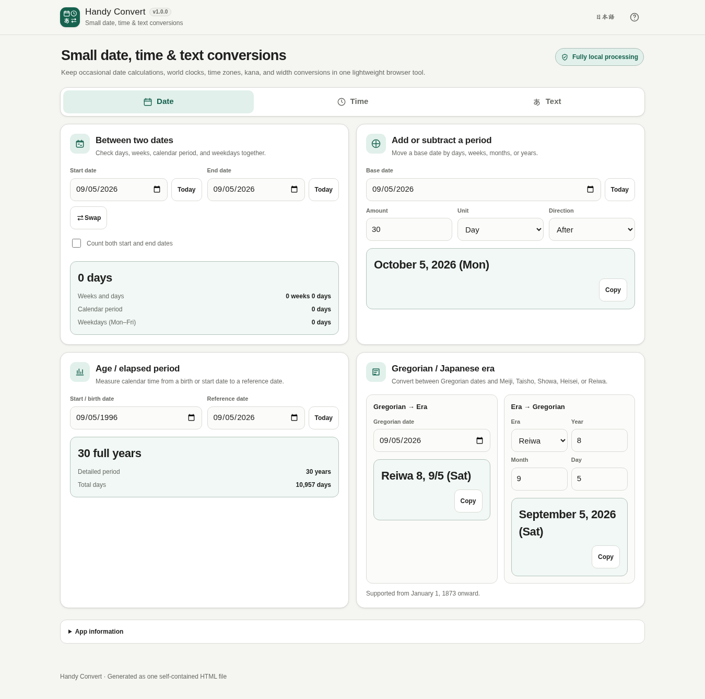

# Handy Convert

[](https://github.com/ttomohisa/htmlapps-handy-convert/actions/workflows/deploy-pages.yml)
[](LICENSE)
[](https://ttomohisa.github.io/htmlapps-handy-convert/)

[日本語版 README](README.ja.md)

A single-HTML utility for everyday date, time-zone, and Japanese-text conversions. It runs in the browser without sending entered dates or text to an external server.

## 🚀 Live demo

### [Open Handy Convert on GitHub Pages](https://ttomohisa.github.io/htmlapps-handy-convert/)

GitHub Pages delivers the initial HTML. After it loads, date calculations, world-clock display, time-zone conversion, Japanese era conversion, kana conversion, and width conversion are performed locally on your device.

[](https://ttomohisa.github.io/htmlapps-handy-convert/)

## Features

- **Compare two dates** — See total days, weeks and days, calendar elapsed period, and weekday count between two dates.
- **Move forward or backward from a date** — Add or subtract days, weeks, months, or years, with end-of-month clamping where necessary.
- **Check age or elapsed calendar time** — Show years, months, days, and total elapsed days from a start date to a reference date.
- **Convert Gregorian and Japanese eras** — Convert dates between Gregorian years and Meiji, Taisho, Showa, Heisei, or Reiwa, including era-boundary validation.
- **Use a local world clock** — Add cities, search by city name, compare day context and UTC offsets, and keep only your selected city list on the device.
- **Convert time zones accurately** — Convert a local date/time between cities using browser-provided IANA time-zone data, including daylight-saving gaps and repeated local times.
- **Convert Japanese kana from one input** — Show hiragana, katakana, and half-width kana results together.
- **Convert full-width and half-width text** — Choose whether letters, numbers, symbols, and spaces are converted while leaving unrelated Unicode characters intact.
- **Japanese / English and mobile-friendly UI** — Use the same app on desktop or smartphone with dedicated Date / Time / Text navigation.
- **Local, single-HTML operation** — No runtime CDN, analytics, telemetry, remote font, or external API is required.

## Quick start

### Use the web demo

Just [open the demo](https://ttomohisa.github.io/htmlapps-handy-convert/). No installation or account is required.

### Use the standalone HTML

1. Download `dist/index.html` or `dist/index.self-extract.html` from this repository.
2. Open the file in a current browser.
3. The app runs from that single file without requiring a local server.

`dist/index.html` is the readable standalone build. `dist/index.self-extract.html` stores the same app as a gzip-compressed payload and restores it locally in the browser with `DecompressionStream`.

### Build it yourself (advanced)

1. Download or clone this repository on Windows.
2. Double-click `build-standalone.bat`.
3. The build verifies the repository and generates the standalone files under `dist/`.
4. Copy either generated HTML file wherever you need it.

This app has no third-party runtime package dependencies, so the normal build does not need to download libraries. Node.js, Python, and a local web server are not required.

## Usage

### Date

- **Between two dates** — Choose a start and end date to see days, weeks + days, calendar elapsed period, and weekdays. Enable **Count both start and end dates** when inclusive counting is required.
- **Add / subtract** — Enter a base date, amount, unit, and direction. Month/year moves clamp to the last valid day when the destination month does not contain the same day.
- **Age / elapsed period** — Enter a start or birth date and a reference date. The result is a calendar elapsed period, not a legal-age determination.
- **Gregorian / Japanese era** — Convert in either direction. The supported historical range begins on January 1, 1873.

### Time

- **World clock** — Search for cities, add or remove them, and compare current local time, date context, and UTC offset. Removed cities can be restored with Undo.
- **Time-zone conversion** — Choose source and destination cities, then enter the source local date/time. If a daylight-saving transition creates a nonexistent local time, the app reports it instead of silently changing the input. If the same local time occurs twice, choose the first or second occurrence.

The world clock uses your device clock. If the device time is incorrect, the displayed current time will also be incorrect.

### Text

- Type or paste text once to see **hiragana**, **katakana**, and **half-width kana** results.
- Full-width / half-width conversion can target **letters**, **numbers**, **symbols**, and **spaces** independently.
- Kanji, emoji, and other characters outside the selected conversion ranges are preserved.
- Each available result can be copied separately. Clearing text supports Undo.

## Publish with GitHub Pages

The repository includes a workflow that verifies the standalone build and deploys `dist/` to GitHub Pages.

1. Push the repository to GitHub as `htmlapps-handy-convert`.
2. Open **Settings → Pages → Build and deployment → Source** and select **GitHub Actions**.
3. Push to `main`, or manually run **Deploy standalone app to GitHub Pages** from the Actions tab.
4. After a successful deployment, the app is available at `https://ttomohisa.github.io/htmlapps-handy-convert/`.

Each push to `main` runs `scripts/check-repository.ps1`, rebuilds the standalone HTML, verifies repository and offline requirements, and then publishes the `dist` directory.

## Development and build layout

```text
.
├─ src/index.template.html       # Application template
├─ app.config.json               # App metadata and build settings
├─ dependencies.json             # Runtime dependency declaration (empty for this app)
├─ dependencies.lock.json        # Dependency lock
├─ build-standalone.bat          # Windows build entry point
├─ build-standalone.ps1          # Standalone HTML builder
├─ scripts/check-repository.ps1  # Repository/build verification
├─ dist/
│  ├─ index.html                 # Readable standalone build
│  └─ index.self-extract.html    # Compressed self-extracting standalone build
└─ .github/workflows/
   ├─ build-standalone.yml       # Pull-request build validation
   ├─ deploy-pages.yml           # GitHub Pages deployment from main
   └─ dependency-updates.yml     # Scheduled dependency check
```

### Build and verify

Run:

```bat
build-standalone.bat
```

For the full repository check used by CI:

```powershell
./scripts/check-repository.ps1
```

The build and verification flow checks, among other things:

- Required template placeholders are resolved exactly once
- Standalone HTML output exists and is valid UTF-8
- Runtime network access is blocked when required by `app.config.json`
- No forbidden external runtime references remain
- The self-extracting build restores the same source HTML
- Required repository files and release assets are present

## Privacy and runtime network protection

The generated app uses browser-side processing only for its conversion features.

- The Content Security Policy includes `connect-src 'none'`.
- No analytics or telemetry is included.
- No external font, CDN, or runtime API is required.
- Entered dates, birth dates, date/time conversion inputs, and text are not persisted by the app.
- The app may store the selected UI language, the last opened category, and cities added to the world clock in `localStorage`.

The GitHub Pages version requires an initial HTML request to load the app. After the app is loaded, the conversion features do not require runtime network access. For use without any network connection, open one of the generated files in `dist/` locally.

## Browser support

Primary targets:

- Chrome
- Edge
- Current major Android browsers
- Current major iPhone browsers

Firefox and Safari are supported where the browser APIs used by the app are available. The responsive layout is designed from 320px upward.

The self-extracting variant requires `DecompressionStream`. If a browser does not support it, use `dist/index.html` instead.

## Limitations

- Weekday counts exclude Saturday and Sunday only; public holidays and country-specific business calendars are not included.
- Age output is a calendar elapsed period and is not intended for legal-age determination.
- Japanese era conversion supports dates from January 1, 1873 onward; historical lunisolar-calendar conversion is not included.
- Time-zone results depend on the IANA time-zone data supplied by the browser, so very old browsers may contain outdated rules.
- Current world-clock time is based on the device clock and is not synchronized with a network time service.
- Full-width / half-width conversion changes only the selected target ranges; unrelated Unicode characters are intentionally preserved.

## Dependencies

Handy Convert has no bundled third-party runtime library dependency.

Date/time processing uses browser-native JavaScript and `Intl` APIs. See [THIRD_PARTY_NOTICES.md](THIRD_PARTY_NOTICES.md) for the repository notice.

## Contributing

Bug reports and feature proposals are welcome through GitHub Issues. See [CONTRIBUTING.md](CONTRIBUTING.md) for development guidance.

## License

Copyright © 2026 ttomohisa

Licensed under the [MIT License](LICENSE).
